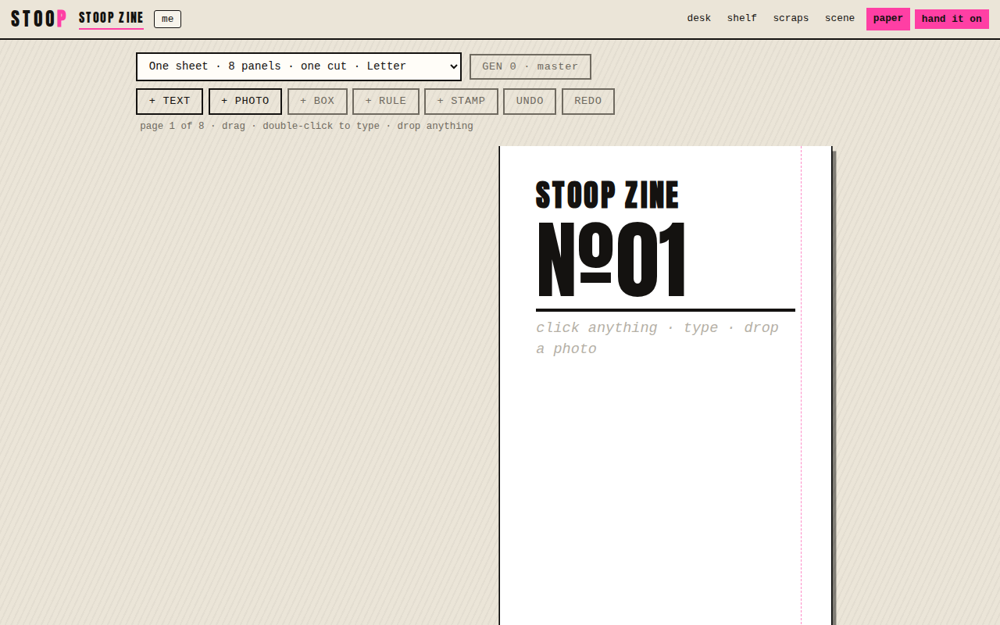

# stoop

A web app for publishing a small zine among people who already write to each other, from submitted pieces to a folded paper issue. The editor for the cycle assembles an issue, and the app lays it out as a folded sheet, a stapled booklet or an exact PDF. Every exported issue is one HTML file that carries the back issues and a working copy of the app. It is plain JavaScript, HTML and CSS, built into one file by a shell script, with no server and no accounts.

**Status: shipping.** Everything [`PLAN.md`](PLAN.md) calls for is built and deployed. The goal it sets itself, a group that did not start the project publishing its second issue with it, has not happened yet.

Live: https://ampactor.dev/stoop/



## Quick start

Open https://ampactor.dev/stoop/ in a browser. There is nothing to install and nothing to sign into. You see the press with the cover of issue №01, as in the screenshot. Click the cover to type on it, or open **scraps** in the top bar to write something down.

To build it from source you need bash, Perl, and the GNU versions of `sed` and `base64` (I ran these on Linux):

```sh
git clone https://github.com/ampactor-labs/stoop
cd stoop
bash build.sh
bash check.sh
```

```
built: artifact/index.html artifact/press.html index.html press/index.html (root: .)
check: all laws hold
```

Then open `index.html` in a browser. A local copy keeps its own storage, separate from the hosted address (see [Keeping your work](#keeping-your-work)).

## Usage

### One cycle

```
the scraps                 lines, pages, photos: everything you wrote down
     |
the desk                   SUBMIT a piece, or PULL IN THE NEW SCRAPS
     |                     CUT what does not run, write the editor's note
     |                     FLOW ONTO THE PAGES
     |                     RING THE BELL: onto the shelf, and the desk moves on
     |
the press                  paste it up, then PAPER: test sheet, swap fold, SAVE PDF, fold
     |
HAND IT ON                 the latest issue as one file that is also a press
     |
the shelf                  MAKE THE SITE: every issue where its back cover points
```

Then the next cycle starts. The scraps drawer holds what people write down. The desk turns new scraps and submitted pieces into an issue, and ringing the bell puts that issue on the shelf and passes the desk to the next person on the roster. The press shows the issue as pages, and its paste-up lets you place text, photos and stamps anywhere on them. The scene drawer holds the roster, the zine's name and the address printed on the back cover. [`docs/GUIDE.md`](docs/GUIDE.md) walks through every drawer.

### What comes out

- **Paper**: a browser print, a PDF the app writes itself at exact paper size, or a flyer with tear-off tabs.
- **Hand it on**: the latest issue as one HTML file. Opened anywhere, it shows the issue and then offers the press it carries, so the next person can make the next issue from it.
- **Make the site** (on the shelf): a zip with every issue as a page and a PDF beside each, for any static host or a thumb drive.
- **Backups and pieces**: a backup file of everything in this browser, and a piece file a contributor sends to whoever has the desk.
- **The bell**: a calendar file with a reminder the day before.

### The hand kit

[`press/`](press/index.html), live at https://ampactor.dev/stoop/press/, is the same one-sheet layout with fold diagrams and starter prompts. It prints with no app involved.

### Keeping your work

Browser storage is per-origin: it is tied to the address the page was opened from. Notes made in a local copy of `index.html` do not appear at the hosted address, and the other way round. Export a backup on one and import it on the other to carry them across. Importing merges by id and keeps the newer copy of anything both sides hold.

Hosting the page publicly does not publish what you write in it. The words and photos stay in your browser. The source contains no `fetch`, `XMLHttpRequest` or other network call, and `check.sh` fails if a source file references another host.

## How it works

The app is about 5,500 lines of JavaScript in 32 files under [`src/js/`](src/js/), plus HTML views and CSS. [`build.sh`](build.sh) concatenates the JavaScript inside one function, inlines the CSS and the two typefaces as base64, drops whole-line comments, and writes one self-contained `index.html`. State lives in `localStorage` and photos in IndexedDB.

An exported issue is that same page plus a JSON seed in a `<script id="stoop-seed">` element. When the page finds a seed it opens as that issue, and the press inside it can make the next one. [`FORMAT.md`](FORMAT.md) specifies the seed, the imposition and the address so that someone can write a compatible press without reading this source.

These parts are written in the repo rather than taken from a library:

- **Imposition** ([`src/js/04-impose.js`](src/js/04-impose.js)): computes where each page sits on the printed sheet from the page count and paper size, so the pages read in order once the sheet is folded.
- **PDF writer** (`src/js/10-pdf.js` to `11c-pdf-stamps.js`): writes the imposed sheet with 1-bit images, and embeds the page's own fonts as TrueType subsets so paper matches the screen.
- **QR encoder** ([`src/js/08-qr.js`](src/js/08-qr.js)): byte mode, error correction level L, versions 1 to 10, for the address on the back cover.
- **Dithering** ([`src/js/02a-dither.js`](src/js/02a-dither.js)): turns photos into pure black and white, with Floyd–Steinberg error diffusion for grain, halftone dots, or hard contrast.
- **Zip writer** ([`src/js/12a-site.js`](src/js/12a-site.js)): packs the site folder.

### Design decisions

- **One file, no network.** Every exported issue carries the whole press, so the press's size is paid again in every file anyone sends. That is why nothing is fetched and why the QR, PDF and zip code lives in the repo. `check.sh` caps the built app at 256 KB. The build is 251 KB today (`wc -c artifact/index.html`), and `test/08-weight.js` publishes a full eight-page issue with a photograph on every page and measures 911 KB against a 1 MB ceiling.
- **Pieces flow into pages.** Content is pieces (title, byline, kind, body), and the pages are slots they flow into. The same issue can move to another format without retyping, and paste-up positions are stored as fractions of a panel so a collage survives the move too.
- **No minimum scene size.** The desk goes round whoever is on the roster, so at two people it alternates. With no server there are no running costs and nothing to pay dues for. The design expects a first scene of two people and a copier, because two people ship on a deadline and eight people with no habit tend to miss the first bell.
- **No feed.** The app has no feed and no ranking, and it keeps no view or like counts. [`DESIGN.md`](DESIGN.md) lists these refusals and the reasons for them.

### The documents

- [`FORMAT.md`](FORMAT.md): the specification of the issue file, the imposition and the address.
- [`PLAN.md`](PLAN.md): the route in seven phases, each with a gate. Phases 0 to 5 are built and phase 6 is written.
- [`DESIGN.md`](DESIGN.md): the system as imagined before anything shipped. Its objects and loops still describe the app; `PLAN.md` replaces its staging.
- [`CHARTER.md`](CHARTER.md): a constitution for a federation that was never built, kept as a template a scene may adopt. Its Article III still binds through the license and `check.sh`.
- [`CONTRIBUTING.md`](CONTRIBUTING.md): the source layout, the workflow, and why each rule in `check.sh` exists.
- [`tool/SPEC.md`](tool/SPEC.md): superseded. It specified a scene tool; its desk and shelf now exist in the app, and its federation half is struck.

## Project layout

```
src/js/         one file per concern, concatenated in name order
src/views/      one HTML file per view
src/fonts/      Anton and Knewave subsets, with their licences
src/press.html  the hand kit
build.sh        assembles the outputs below from src/
check.sh        the repository's rules as checks
index.html      the built app (committed; GitHub Pages serves it)
press/          the built hand kit
artifact/       both pages without a doctype, for the claude.ai artifact publisher
test/           the Playwright browser suites
```

## Deploy

GitHub Pages serves `main` at https://ampactor.dev/stoop/ and https://ampactor.dev/stoop/press/. The built `index.html` and `press/index.html` are committed, so a change reaches the site when a commit with the rebuilt files lands on `main`. There is no backend. `check.sh` fails if the committed outputs differ from a fresh build of `src/`.

## Testing

`check.sh` runs in under a second (0.4 s here) and needs nothing beyond what the build needs. It fails if any of these do not hold:

1. The committed outputs match a fresh build of `src/`.
2. No file in `src/` is over 300 lines.
3. No source file references another host.
4. The page weight in the footer is within 3 KB of the real size.
5. The app and the hand kit fold the one-sheet zine the same way.
6. The built app is at most 256 KB.
7. `LICENSE`, `LICENSE-docs` and both font licences are present.
8. The built pages contain no absolute URL.
9. The built page carries both `@font-face` rules.

CI ([`.github/workflows/check.yml`](.github/workflows/check.yml)) runs `bash check.sh` on every push and pull request, with no third-party actions. The same script runs as a pre-commit hook once you set `git config core.hooksPath .githooks`.

The browser suites in [`test/`](test/) check that the app behaves. They open the built `index.html` in Chromium through Playwright:

```sh
npm install playwright
node test/run.js
```

If Playwright finds no browser, run `npx playwright install chromium`, or set `PLAYWRIGHT_CHROMIUM` to an existing Chromium binary. The run took about five minutes here and ended with:

```
259/259 passed
```

The 15 suites cover two issues that keep their own words, re-flowing pieces into another format, the fit meter, an exported issue making the next issue on a machine with no storage of its own, a scene of four, the paste-up, the site zip, and the weight of a full issue. The QR suite compares the encoder's output module for module with fixtures from the Python `qrcode` library. The PDF suite parses the written bytes and checks every cross-reference offset and stream length. [`CONTRIBUTING.md`](CONTRIBUTING.md) lists what each suite covers.

Not tested: CI runs only `check.sh`, so the browser suites run only when someone runs them locally, and only in Chromium. No test prints on a real printer, scans the QR code with a phone, or opens the PDF in a PDF reader.

## Limitations

Everything lives in the browser that made it. There is no server to fall back on and storage is tied to the address the page came from, so a backup file is the only copy that outlives a cleared cache. Moving work between a phone and a laptop means exporting a file on one and importing it on the other.

- **The PDF handles Latin-1 only.** The typefaces are cut down to Latin and the PDF writer encodes text as WinAnsi (the Latin-1 character set), so a letter outside it (ł, ş, Greek, Cyrillic, any emoji) comes out of SAVE PDF as a question mark.
- **Sync is a file.** Two people on two devices see each other's work only when one hands the other a file (a backup, a piece or an issue) and it is imported.
- **Printers and folding vary.** The page asks for a test sheet before a print run, and offers the other fold when the page numbers come out shuffled.
- **No federation.** Earlier designs linked scenes into a network, with member pages, vouching and a cooperative to run it. `PLAN.md` struck all of that, so each scene stands alone, and a network is left to whoever wants to build one.

## Roadmap

- **A scene the project did not found ships its second issue.** This is the gate of `PLAN.md` phase 6 and the only measure the project keeps. It depends on other people, so more building cannot close it.
- **A name.** "stoop" is a working name (a stoop is where you sit with your people, facing the street). The people who use it should choose the final one, so it waits for them.

## License

The software is under the GNU Affero General Public License, version 3 or later ([LICENSE](LICENSE)), as Article III of [`CHARTER.md`](CHARTER.md) requires. The prose and design documents are under Creative Commons Attribution-ShareAlike 4.0 ([LICENSE-docs](LICENSE-docs)). The two bundled typefaces are under the SIL Open Font License ([Anton](src/fonts/OFL-Anton.txt), [Knewave](src/fonts/OFL-Knewave.txt)).
